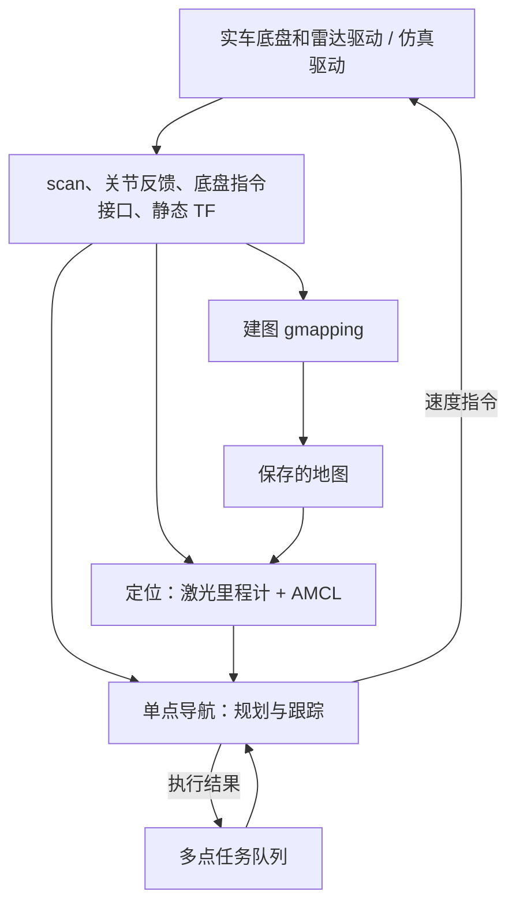

# 模块职责与依赖

## 依赖规则

- 驱动层不知道目标点、地图或比赛任务，不启动导航。
- 建图、定位都消费 `/scan`。它们不再启动模拟雷达噪声节点，模拟雷达由仿真驱动统一管理。
- 建图与定位是两种互斥的运行阶段。切换时先停止上一阶段 launch；脚本检测已运行的 gmapping、AMCL 和导航并报告冲突，不主动杀节点。
- 单点导航只消费地图、定位和底盘反馈，不启动任何驱动、建图或定位。
- 多点任务层只管理点位、顺序与阶段结果，不发布底盘速度。
- bringup 是组合层：`multi.launch` 包含一个单点执行器和一个队列节点。启动 multi 前停止 single，避免重复执行器。

每层是独立 ROS 包。导航内部现有 `ackermann_core`、`path_tracking`、`local_planner` 等模块保持职责分工，本次没有把成熟的规划/阶段逻辑重新写成另一套状态机。

## 接口与唯一发布者

| 接口 | 发布者 | 消费者 |
|---|---|---|
| `/scan` | 实车雷达驱动，或仿真的 laser_noise | 建图、定位、导航 |
| `base → laser` TF | 实车驱动/外参，或仿真 robot_state_publisher | 建图、定位、导航 |
| `odom → base` TF | 默认 laser_scan_matcher；也可明确选择实车里程计 | 建图/AMCL/导航 |
| `map → odom` TF | 建图时 gmapping，定位时 AMCL | 导航 |
| `/map` | 建图时 gmapping，定位时 map_server | 导航 |
| `/move_base_simple/goal` | 单点 RViz、goal 命令或多点队列 | 单点执行器 |
| `/multi_nav/goal` | 多点 RViz 的 2D Nav Goal 工具 | 多点队列 |
| `/single_nav/status` | 单点执行器 | 多点队列、终端 |
| 配置指定的 cmd_topic | 单点执行器或手动驾驶工具（同一时刻一个） | 底盘 |

如果底盘已经发布 `odom → base`，建图和定位都传 `scan_odometry:=false`，不能继续启动另一个激光里程计 TF 发布者。默认保留现有纯雷达定位策略，不要求实车必须有轮式里程计。

单点与多点分别使用 single.rviz / multi.rviz。两者的 2D Nav Goal 外观相同，但 Topic 不同。多点选点仅加入队列，调用 execute 才发送执行目标。多点运行时不要用单点 RViz 或直接发布 `/move_base_simple/goal` 来插队。

## 源码迁移

| 原位置 | 当前位置 |
|---|---|
| docker/overlay 中的规划与控制 Python | src/smartcar_navigation/scripts |
| multi_goal_nav.py / launch | src/smartcar_mission |
| localization/amcl 启动逻辑 | src/smartcar_localization/launch |
| gmapping.launch | src/smartcar_mapping/launch |
| Gazebo 插件模板和传感器模拟 | src/smartcar_sim |
| inspection_car.urdf | src/smartcar_description |
| RViz 与流程组合 | src/smartcar_bringup |
| 工作空间源码压缩包和未使用的旧实现 | archive、legacy-reference.zip |

历史文档集中在 docs/previous，不能当作当前启动说明。Docker 只负责依赖和源码构建；实车也使用同一份 src。未擅自增加开源授权，旧 package.xml 中的 TODO license 仍需项目所有者确定。
